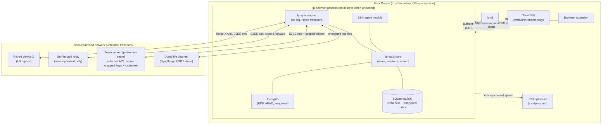

# LocalPass — Product Requirements Document

**Version:** 1.0
**Date:** 2026-07-04
**Status:** Accepted — living specification
**License target:** Open source (AGPL-3.0 core/daemon, MPL-2.0 GUI, MIT/Apache-2.0 client libraries — see §5.6)

---

## 1. Executive Summary

LocalPass is a fully local, self-hosted password and secrets manager that serves as an open-source alternative to 1Password, built for people who refuse to put their secrets in someone else's cloud. All data lives encrypted on the user's own machines; the network is used only for user-controlled, end-to-end-encrypted synchronization between the user's devices or trusted teammates, authenticated by SSH keys or scoped API keys. Beyond personal passwords, LocalPass is designed around developer workflows: it manages `.env` files, API keys, SSH keys, and certificates, and can inject secrets directly into processes so plaintext secrets never need to sit on disk. The product ships as a memory-safe Rust core with a first-class CLI, a cross-platform desktop app, and a browser-extension autofill bridge — all offline-capable, auditable, and controllable by the user from key derivation to sync transport.

---

## 2. Objectives and Success Metrics

### 2.1 Objectives

| # | Objective | Rationale |
|---|-----------|-----------|
| O1 | **Zero mandatory cloud.** Every core feature works with no third-party service, forever. | Core differentiator vs. 1Password/Bitwarden cloud. |
| O2 | **Enterprise-grade cryptography with a small, auditable surface.** | Trust is the product. A secrets manager that can't be audited can't be trusted. |
| O3 | **Developer-native workflows.** Secrets injection, `.env` management, CLI parity with GUI. | Underserved by consumer password managers; poorly served by heavyweight tools (Vault). |
| O4 | **Secure, explicit sharing.** Device-to-device and team sharing over user-controlled channels with E2EE. | Sharing is the reason people tolerate cloud managers; solve it without the cloud. |
| O5 | **Usable enough for non-experts.** A developer's partner should be able to use the GUI for personal passwords. | Security tools fail when usability pushes users to workarounds. |

### 2.2 Success Metrics

| Category | Metric | Target (12 months post-1.0) |
|----------|--------|------------------------------|
| Security | Independent security audit of core crypto | Completed, all criticals/highs resolved before 1.0 |
| Security | Vulnerabilities from unsafe memory handling | 0 (enforced by Rust + `#![forbid(unsafe_code)]` in core, CI-gated) |
| Performance | Vault unlock (10k items, mid-range laptop) | < 1.5 s (dominated by intentional KDF cost) |
| Performance | Local search latency (10k items) | < 50 ms p95 |
| Performance | Idle memory footprint (daemon) | < 50 MB RSS |
| Usability | New user: install → first secret stored | < 5 minutes without docs |
| Usability | Dev workflow: `localpass run -- npm start` works with zero config after vault setup | 1 command |
| Adoption | GitHub stars / active installs (proxy: opt-in-free, measured by release download counts) | 10k stars; sustained release downloads |
| Community | External contributors with merged PRs | ≥ 25 |
| Reliability | Data-loss bugs reported against released versions | 0 |
| Reliability | Sync conflict auto-resolution rate (no user intervention) | > 99% of sync operations |

**Anti-metrics (things we explicitly do not optimize for):** telemetry-derived engagement, account signups (there are no accounts), cloud MAU.

---

## 3. User Personas

### P1 — Solo Developer ("Dana")
Full-stack developer, 3 side projects and a day job. Has API keys in `.env` files scattered across repos, some accidentally committed once. Uses a cloud password manager for personal passwords but doesn't trust it with production credentials.
**Needs:** one place for personal + dev secrets; `localpass run` to inject env vars; sync between desktop and laptop over home Wi-Fi or Tailscale; SSH key storage with agent integration.
**Success:** never writes a plaintext `.env` again; secrets follow her between machines automatically.

### P2 — Small Team Lead ("Marco")
Leads a 6-person product team. Shares database credentials and third-party API keys today via a pinned Slack message and a shared spreadsheet (he knows). No dedicated ops person; HashiCorp Vault is overkill.
**Needs:** a shared team vault hosted on a machine he controls (an office server or a VPS); per-member access via their SSH keys; revocation when someone leaves; audit log of who read what.
**Success:** offboarding = revoke one key + rotate flagged secrets from a generated checklist.

### P3 — Security-Conscious Power User ("Yuki")
Privacy advocate, self-hosts everything (Nextcloud, Home Assistant). Not a professional developer but comfortable with a terminal. Left 1Password over cloud concerns.
**Needs:** TOTP codes, passkeys/notes/documents, browser autofill, YubiKey unlock, verifiable builds, exportable data.
**Success:** feature parity with the parts of 1Password she used, with everything under her control.

### P4 — Ops / Platform Engineer ("Sam")
Maintains CI/CD for a 30-person company. Wants deployment secrets sourced from infrastructure the company owns; needs machine identities (CI runners) to read specific secrets and nothing else.
**Needs:** headless CLI/daemon on servers; scoped, expiring API keys for CI; secret versioning and rollback; audit trail.
**Success:** CI reads exactly the secrets it's granted via a short-lived token; a leaked token exposes one scope, not the vault.

---

## 4. Functional Requirements

Priorities: **[MVP]** = required for 1.0, **[P2]** = Phase 2 (within ~6 months of 1.0), **[F]** = Future/backlog.

### 4.1 Secret Types

| Type | Priority | Notes |
|------|----------|-------|
| Login (username/password/URLs/custom fields) | MVP | Multiple URLs per item for autofill matching. |
| Secure note (Markdown) | MVP | |
| API key / token | MVP | First-class type with fields: key, secret, endpoint, expiry, rotation-reminder date. |
| Environment variable set (`.env` bundle) | MVP | An ordered map of KEY=value pairs stored as one item; see §4.8. |
| SSH key pair | MVP | Private key encrypted; public key/fingerprint indexed. Generation (Ed25519, RSA-4096) in-app. |
| TOTP secret | MVP | RFC 6238; codes computed locally; QR import. |
| File attachment | P2 | Encrypted blobs, per-item, size-capped (default 50 MB, configurable). |
| Certificate / private key (X.509, PEM/PKCS#12) | P2 | Expiry tracking and reminders. |
| Passkey (WebAuthn credential) | P2 | Store + sync passkeys; requires browser extension maturity. |
| Database credential | P2 | Structured type (host, port, user, password, connection-string template). |
| Credit card / identity | F | Consumer parity items; low priority for the core audience. |

All types support: custom fields (text/hidden/URL/date), tags, favorite flag, item-level notes, and full version history (§4.10).

### 4.2 Vaults and Organization

- **[MVP]** Multiple vaults per user (e.g., `personal`, `work`, `acme-prod`). Each vault has its own vault key; compromise or sharing of one vault never exposes another.
- **[MVP]** Folders (single-level per item) **and** tags (many per item). Tags are the primary organizing tool; folders exist for people who think in folders.
- **[MVP]** Full-text search across titles, usernames, URLs, tags, and custom field names (not secret values) with < 50 ms results. Fuzzy matching on titles.
- **[MVP]** Search filters: `type:ssh-key tag:prod vault:work`.
- **[P2]** Search inside secure-note bodies (opt-in per vault; increases index sensitivity — index is encrypted at rest like all data, see §6.3).
- **[P2]** Item templates (define a custom type once, reuse).
- **[F]** Smart views (saved searches), e.g., "expiring in 30 days".

### 4.3 Local Storage and Encryption Model

- **[MVP]** All persistent data encrypted at rest. No plaintext secret ever written to disk by LocalPass, including logs, caches, crash dumps (crash reporting disabled by default and scrubbed if enabled), and search indexes.
- **[MVP]** **Key hierarchy (envelope encryption):**
  1. **Master password** → KDF (Argon2id, §5.2) → **Master Unlock Key (MUK)**.
  2. MUK decrypts the **Account Key** (random 256-bit, generated at setup). The account key never changes when the password changes — password rotation only re-wraps it.
  3. Account Key decrypts per-**Vault Keys**.
  4. Vault Key decrypts per-**Item Keys**; each item (and each version of it) is encrypted with its own key. Sharing an item = wrapping its item key for the recipient, never re-encrypting the vault.
- **[MVP]** A **Secret Key** (à la 1Password): a high-entropy, locally generated 128-bit value mixed into the KDF input, stored on-device (OS keychain where available) and in the user's Emergency Kit (§4.11). Result: an attacker with only a copy of the vault file must brute-force 128 bits even if the master password is weak.
- **[MVP]** Auto-lock: on timeout (default 10 min), on OS lock/suspend, on demand. Locked state = all key material zeroized from memory.
- **[MVP]** Unlock methods: master password; **[P2]** biometric/OS-native unlock (Touch ID, Windows Hello) gated by OS keystore holding a wrapped MUK; **[P2]** YubiKey (FIDO2 `hmac-secret`) as a second KDF factor; **[F]** TPM-bound device keys.
- **[MVP]** Multiple OS-user isolation: vaults stored under the user profile with OS file permissions locked down (0600 / owner-only ACLs).

### 4.4 Interfaces: CLI, Desktop GUI, Local Web UI

**CLI — [MVP]** (the CLI is a first-class product, not an afterthought):
- `localpass init | unlock | lock | status`
- `localpass item create|get|edit|rm|mv|history|restore` (scriptable; `--json` output everywhere; secret values only printed with explicit `--reveal` or `-f field`)
- `localpass generate` (passwords, passphrases — EFF wordlist, PINs; entropy shown)
- `localpass run`, `localpass env`, `localpass inject` (§4.8)
- `localpass ssh` (agent integration, §4.8)
- `localpass share | trust | serve` (§4.5)
- `localpass export | import` (§4.6), `localpass backup | restore` (§4.11)
- `localpass totp <item>` → prints current code; `--copy` puts it on clipboard with auto-clear.
- Shell completions (bash/zsh/fish/PowerShell); man pages.
- **Agent/daemon:** a per-user background process holds unlocked keys in protected memory so repeated CLI calls don't re-prompt; communicates over a local socket (Unix domain socket / Windows named pipe) with peer-credential checks. Explicit `localpass lock` or timeout drops keys.

**Desktop GUI — [MVP]:** Windows, macOS, Linux. Vault browsing, search, item CRUD, generator, TOTP display, history, sharing management, settings. System tray quick-search. Keyboard-first navigation.

**Local Web UI — [P2]:** optional, served by the daemon on `127.0.0.1` only (never binds a public interface without an explicit, loudly-warned flag), for headless server administration. Authenticated by the same session as the CLI.

**Mobile — [F]:** read-mostly companion apps (iOS/Android) syncing over the same E2EE protocol. Out of MVP scope; documented early because it constrains protocol design (the sync protocol must not assume desktop-class peers).

### 4.5 Secure Sharing and Sync

Sharing model: **explicit trust, user-controlled transport, E2EE always.** The transport is never trusted; every payload is end-to-end encrypted for specific recipient keys before it leaves the device.

- **[MVP] Device pairing (same user, multiple machines).**
  - Pair via short authentication string (SAS): both devices show a 6-word phrase the user compares (Bluetooth-pairing UX), bootstrapped over local network (mDNS discovery) or a manually entered address.
  - After pairing, devices hold each other's long-term public keys; all sync is mutually authenticated (Noise-based protocol, §5.4).
- **[MVP] Sync transports:**
  - **File-based sync (default onboarding suggestion):** the vault's encrypted, append-only change log can be replicated by any dumb file channel (Syncthing, a USB stick, a network share, even a git repo). The log is E2EE and integrity-protected, so the channel needs zero trust — and there is zero networking code in the critical path.
  - **Direct LAN / overlay network (recommended for teams):** devices find each other via mDNS or a configured host:port. Works transparently over Tailscale/WireGuard/VPN since those just provide IP connectivity — no special integration needed, but docs treat Tailscale as a first-class path. Presented prominently in onboarding alongside the file-based default.
- **[P2] Self-hosted relay (`localpass-relay`):** a tiny, stateless-ish store-and-forward server (single static binary) the user runs on a VPS for devices that are never online simultaneously. The relay sees only ciphertext and recipient-key IDs; it cannot read, forge, or silently drop-and-replace payloads (clients detect gaps via log sequence hashes). Enrollment is **pairing-code-gated** (a new device must present a short-lived code minted by an already-enrolled device), and docs plus CLI warnings explicitly discourage public multi-tenant relay hosting.
- **[P2] Team sharing.**
  - A **shared vault** lives on a machine a team controls (office server/VPS) running the LocalPass daemon in serve mode.
  - **Membership = public keys.** Members are added by SSH public key (imported from file, `~/.ssh`, or GitHub username fetch — with fingerprint verification prompt) or by LocalPass-native key. Vault key is wrapped for each member's key.
  - **Roles:** reader / writer / admin (admin can manage membership). Enforced by the serving daemon *and* cryptographically where possible (readers never receive write-signing capability; membership changes are signed by admins).
  - **Revocation:** removing a member triggers vault-key rotation (new vault key wrapped for remaining members) and generates a **rotation checklist** of secrets the removed member could have read — because E2EE cannot un-disclose data, the honest mitigation is guided rotation.
- **[P2] Machine identities / API keys.**
  - `localpass token create --vault ci --role reader --ttl 30d --scope "tag:deploy"` → a scoped bearer token for headless clients (CI runners). Tokens are hashed at rest server-side, revocable individually, expiring by default, and every use is audit-logged.
- **[F] One-time send:** share a single secret via an encrypted, self-expiring payload (link + out-of-band passphrase), for recipients who don't run LocalPass.

**Conflict handling:** see §6.4.

### 4.6 Import / Export

- **[MVP] Import:** 1Password (1PUX), Bitwarden (JSON), LastPass (CSV), KeePass (KDBX 4), generic CSV with column mapping UI, `.env` files (→ env-set items), plain SSH keys from `~/.ssh`.
- **[MVP] Export:** encrypted LocalPass archive (age-encrypted tarball — recoverable with the standalone `age` tool + documented format, so users are never locked in even if LocalPass dies); plaintext JSON/CSV behind explicit multi-step confirmation with a screen-reader-visible warning; `.env` file export per env-set.
- **[P2]** Chrome/Firefox/Safari password CSV import; Dashlane, Proton Pass.
- Import runs 100% locally; import files are shredded (best-effort overwrite + delete) after successful import, with user confirmation.

### 4.7 Browser Integration / Autofill

- **[MVP]** Browser extension (Chrome/Chromium family, Firefox) communicating with the desktop app via **native messaging** (no localhost HTTP port — avoids the class of local-port-hijack bugs that have hit other managers).
- **[MVP]** Autofill on explicit user action (click extension / keyboard shortcut). URL matching by registrable domain with per-item exact-match option; **never autofill cross-origin iframes; never auto-submit; fill only on user gesture** — these are hard rules, not settings.
- **[MVP]** Inline save prompt on detected login form submission (opt-out).
- **[P2]** TOTP autofill after password fill; phishing-domain warning (filled-before domain mismatch); Safari extension.
- **[P2]** Passkey provider (WebAuthn) where platform APIs allow.
- **[F]** Auto-type for native apps (global hotkey → keystroke injection), Linux-first via portal APIs.

### 4.8 Developer Workflows: `.env` and Secret Injection

This is the flagship developer feature set.

- **[MVP] `localpass run`:** `localpass run --env-set myapp/dev -- npm start` resolves the env-set, injects variables into the child process environment, and execs it. Secrets exist only in the child's environment, never on disk. Supports `--vault`, multiple `--env-set` layering, and `-e KEY=item://path/field` ad-hoc mappings.
- **[MVP] Reference syntax in `.env` files:** commit a `.env` containing references, not values:
  ```
  DATABASE_URL=localpass://work/myapp-db/url
  STRIPE_KEY=localpass://work/stripe/secret
  ```
  `localpass run --env-file .env -- cmd` resolves references at spawn time. The committed file is now safe by construction. An `op://` alias is accepted for 1Password migration muscle memory (`op://vault/item/field` resolves identically).
- **[MVP] `localpass env export --format dotenv|json|shell`:** materialize an env-set to stdout for piping (explicit, discouraged-in-docs path for tools that demand a file; `--file` writes with 0600 and registers the file for `localpass env clean`).
- **[MVP] `.env` import & drift detection:** `localpass env import .env --as myapp/dev`; `localpass env diff .env myapp/dev` shows drift between a local file and the stored set.
- **[P2] Watch & sync:** `localpass env watch` monitors registered `.env` files, warns on plaintext secrets appearing in them (entropy + known-prefix heuristics: `sk_live_`, `AKIA…`, PEM headers), and offers one-key "absorb into vault and replace with reference."
- **[MVP] SSH agent:** `localpass ssh-agent` implements the SSH agent protocol backed by vault-stored keys (keys never touch disk); or plugs into the system agent via `localpass ssh add`. Per-key confirmation prompts optional.
- **[P2] Git integration:** `localpass git-credential` helper; signing-key sourcing for commit signing.
- **[P2] CI/CD:** headless mode using scoped tokens (§4.5): `LOCALPASS_TOKEN=… localpass run --server ssh://vault.internal -- ./deploy.sh`. GitHub Actions / GitLab CI snippets in docs. (LocalPass targets *self-hosted* runners and user infrastructure; it does not try to replace cloud-native secret stores for fully managed CI.)
- **[F] Process-scoped secret files:** mount secrets as ephemeral files via memfd/`/dev/shm` (Linux) for tools that require file paths (e.g., service-account JSON), auto-removed when the child exits.

### 4.9 Audit Logging

- **[MVP]** Local, append-only, tamper-evident (hash-chained) audit log per device: unlocks, failed unlocks, item reads of secret values, edits, exports, shares, token uses. Log entries contain item IDs and metadata, never secret values.
- **[P2]** Team-server audit log: who (key fingerprint) read/wrote what, when, from where; queryable via CLI (`localpass audit --vault acme-prod --since 7d`); export to JSONL for SIEM ingestion.
- **[P2]** Anomaly nudges: "item X was read by token Y for the first time."

### 4.10 Versioning and History

- **[MVP]** Every item edit creates an immutable version. View diffs (field-level, secrets masked until revealed), restore any version. Old passwords retrievable ("what was this before I rotated it?").
- **[MVP]** Deleted items go to per-vault trash (30-day default, configurable) before permanent shredding.
- **[MVP]** Retention default is **keep-forever** — recoverability is a killer feature and silent data loss is unacceptable. To keep this honest: per-vault storage statistics are prominently visible (items, versions, trash, attachments), and a one-click **"Prune old versions"** action (age/count criteria) plus `localpass vault prune` give explicit, easy control. Automatic retention policies remain **[P2]** and opt-in.

### 4.11 Backup and Recovery

- **[MVP] Emergency Kit:** generated at setup — a printable PDF/text containing the Secret Key, vault fingerprints, and recovery instructions. The user is firmly nudged to print/store it offline. **Explicit doctrine: there is no cloud reset. Lose password + Secret Key + all devices = data is gone.** This is stated at setup, not buried in docs.
- **[MVP] Automatic local backups:** rotating encrypted snapshots (default: daily, keep 30) to a configurable location (external drive, NAS path). Backups are the same E2EE format — safe on untrusted storage.
- **[MVP] `localpass backup verify`:** integrity-check a backup and confirm it decrypts (using current keys) without restoring.
- **[MVP] Restore:** full-vault restore and single-item restore from any backup.
- **[P2] Paper backup of account key:** optional QR/BIP39-style word encoding of the account key for cold storage.
- **[P2] Social/quorum recovery:** Shamir secret sharing of the account key (k-of-n shares to trusted contacts/locations). Off by default; power-user feature.
- **[F] Dead-man switch / emergency access:** grant a trusted person time-locked access.

---

## 5. Non-Functional Requirements

### 5.1 Security Principles (summary — full threat model in §8)

- **Zero trust in transports and storage channels.** Anything leaving the process boundary is ciphertext authenticated to specific recipient keys.
- **Zero knowledge by architecture:** there is no server role in the system that can read secrets — including the user's own relay/team server for payload contents (the team server enforces access control but stores wrapped keys and ciphertext).
- **Memory safety:** core in Rust; `unsafe` forbidden in the crypto/vault crates; key material in `zeroize`-on-drop containers; mlock/VirtualLock best-effort for key pages; core dumps disabled for the daemon process.
- **Least privilege:** the GUI talks to the daemon over an authenticated local IPC channel; the browser extension can only request fill-scoped operations, never raw vault export; tokens are scoped and expiring.
- **Audited, boring crypto:** no novel primitives, no custom protocol constructions where a profile of Noise/age/standard AEADs suffices (§5.2). Crypto agility via versioned format headers, not runtime negotiation (downgrade-attack resistance).
- **Reproducible, verifiable builds:** signed releases, published checksums, reproducible-build target for the CLI/daemon; SLSA-style provenance for release artifacts.

### 5.2 Cryptographic Standards

| Purpose | Choice | Notes |
|---------|--------|-------|
| Password KDF | **Argon2id** | Defaults ≥ OWASP current guidance (initially m=64 MiB, t=3, p=4), auto-calibrated upward per device; parameters stored in header, re-derivable on change. |
| Key mixing | HKDF-SHA-256 | Combining MUK + Secret Key; domain-separated labels everywhere. |
| Symmetric AEAD | **XChaCha20-Poly1305** | Random 192-bit nonces safe at scale; constant-time, no AES timing-channel concerns on old hardware. AES-256-GCM as an alternate suite for FIPS-leaning deployments. |
| Asymmetric (sharing/wrapping) | **X25519** (ECDH) + XChaCha20-Poly1305 (sealed to recipient) | The `age`-style recipient model. |
| Signatures (sync log, membership, releases) | **Ed25519** | SSH-key interop: users' existing Ed25519 SSH keys can be trust anchors. |
| Transport | **Noise Protocol (XX / IK patterns)** over TCP/QUIC | Mutual auth by static keys = device identity. |
| Export archives | **age** format | Deliberately recoverable with third-party tooling. |
| Random | OS CSPRNG (`getrandom`) only | |

### 5.3 Performance

| Requirement | Target |
|-------------|--------|
| Search (10k items) | < 50 ms p95 |
| Item decrypt + reveal | < 10 ms after unlock |
| Unlock | KDF-dominated by design; UI shows progress; target < 1.5 s default params |
| Cold start (CLI) | < 100 ms to daemon-connected prompt |
| Daemon idle | < 50 MB RSS, ~0% CPU |
| GUI memory | < 250 MB typical |
| Sync of 1 changed item | < 1 s on LAN |
| Vault scale | 100k items per vault without degradation beyond linear storage |

### 5.4 Reliability and Availability

- **Offline-first, always.** Read/write/search/generate/inject all work with zero network. Sync is opportunistic and resumable.
- **Crash safety:** all writes via SQLite WAL transactions; a power cut mid-write never corrupts the vault; append-only change log enables reconstruction.
- **Sync convergence:** see §6.4 — deterministic conflict resolution; no silent data loss ever (losing side of a conflict is preserved as a version).
- **No single point of failure for personal use:** every paired device holds a full replica.
- Team server downtime degrades to read/write-local-then-sync-later, not outage.

### 5.5 Usability and Accessibility

- First-run wizard: master password strength guidance (zxcvbn-style feedback), Emergency Kit generation, optional import — under 5 minutes.
- Progressive disclosure: consumer features on the surface, developer/ops features one level down; the GUI never requires the CLI and vice versa.
- Keyboard-first: full GUI operability without a mouse; global quick-search hotkey.
- Accessibility: WCAG 2.2 AA for GUI and web UI; full screen-reader labeling (NVDA/VoiceOver tested); honors OS reduced-motion/high-contrast; CLI output readable without color.
- Localization-ready (Fluent-based string externalization); English-only at 1.0.
- Documentation as a feature: threat-model page in plain language ("what LocalPass protects you from, and what it can't").

### 5.6 Maintainability, Extensibility, Licensing

- **Licensing (decided):** AGPL-3.0 for core/daemon (keeps hosted forks honest); **MPL-2.0 for the GUI/desktop apps** (file-level copyleft sidesteps corporate blanket-AGPL bans without going fully permissive); MIT/Apache-2.0 for client libraries, import/export format code, and the relay (maximizing ecosystem reuse). CLA-free; DCO sign-off.
- **Workspace layout:** small crates with hard boundaries — `lp-crypto` (audited surface, minimal deps), `lp-vault` (storage), `lp-sync`, `lp-daemon`, `lp-cli`, `lp-gui`. `lp-crypto` has a frozen, documented API and its own audit cadence.
- **Plugin architecture [P2]:** out-of-process plugins (separate binaries speaking a versioned JSON-RPC over stdio) for importers, secret-source providers, and notifiers. Out-of-process = a malicious/buggy plugin can't read vault memory; plugins receive only the data the user grants.
- **Formats are specs:** vault file format, sync log format, and wire protocol get versioned public specifications in-repo, so third-party implementations and recovery tools are possible.
- **CI gates:** `cargo audit`/`cargo deny` (license + advisory), fuzzing (cargo-fuzz on parsers: import formats, sync log, IPC), Miri on core crates, mutation testing on `lp-crypto`, cross-platform test matrix.

### 5.7 Scalability

| Dimension | Target |
|-----------|--------|
| Items per vault | 100k |
| Vaults per user | 50 |
| Devices per user | 10 |
| Members per shared vault | 100 |
| Concurrent clients per team server | 500 |
| Attachment total per vault | 10 GB |

These are validation targets, not hard limits.

### 5.8 Compliance Considerations

LocalPass itself is a tool, not a service, so it carries no direct compliance burden — but users deploy it inside regulated environments:

- **GDPR:** local-only storage is inherently favorable; export/delete tooling supports data-subject workflows.
- **SOC 2 / ISO 27001 (users'):** audit logs (§4.9), access scoping, and rotation checklists map to common control requirements; provide a "control mapping" doc [P2].
- **FIPS-leaning environments:** the alternate AES-256-GCM suite plus documented KDF params; no FIPS-validation claim (would require validated modules — noted as a Future option via a swappable crypto backend).
- **Export controls:** standard published-crypto open-source exemptions (ECCN 5D002 self-classification note in repo).

---

## 6. Tech Stack Recommendation

### 6.1 Language: Rust (core, CLI, daemon, sync, relay)

Memory safety eliminates the dominant vulnerability class for a secrets manager; no GC pauses or runtime to smuggle key material around; first-class cross-compilation; single static binaries ideal for servers/CI; excellent audited crypto ecosystem. TypeScript/Svelte only in the GUI/web/extension layer, which never holds long-term key material (§6.5).

### 6.2 Cryptography

| Component | Crate | Why |
|-----------|-------|-----|
| AEAD | `chacha20poly1305` (RustCrypto) | Audited (NCC 2020), pure Rust, constant-time. |
| KDF | `argon2` (RustCrypto) | Reference-conformant Argon2id. |
| HKDF/SHA-2 | `hkdf`, `sha2` | RustCrypto, widely reviewed. |
| X25519/Ed25519 | `x25519-dalek`, `ed25519-dalek` | De-facto standard, audited lineage. |
| Transport | `snow` (Noise) | Mature Noise implementation; we use standard XX/IK patterns only. |
| Export | `age` crate | Interop with the standalone age tool = user exit hatch. |
| Hygiene | `zeroize`, `secrecy` | Drop-zeroed key containers throughout. |
| RNG | `getrandom` → OS CSPRNG | No userspace RNG state. |

Rationale for RustCrypto + dalek over libsodium bindings: pure-Rust keeps the build reproducible and cross-compilable without C toolchain variance, keeps the audit surface in one language, and these specific crates have real audit history. libsodium (via `libsodium-sys`) remains the documented fallback if an audit flags a gap. **Rule: `lp-crypto` is the only crate allowed to depend on primitive crates; everything else uses its high-level, misuse-resistant API** (e.g., `seal_for_recipients()`, not "here's a nonce").

### 6.3 Storage

- **SQLite** via `rusqlite`, WAL mode — the most battle-tested storage engine on earth; single-file vaults are easy to back up, copy, and reason about.
- **Application-layer envelope encryption, not SQLCipher:** secret payloads are encrypted per-item (per-version) with item keys before insertion; the schema stores ciphertext blobs plus the minimal indexable metadata. Reasons: (a) per-item keys enable item-granular sharing and re-wrap-on-revoke, which whole-file encryption cannot; (b) the crypto stays in audited Rust rather than a C extension; (c) key hierarchy (§4.3) is uniform across storage, sync, and backup.
- **Metadata policy:** titles/URLs/usernames/tags are encrypted at rest too (vault-key-derived index keys); the search index is **persisted encrypted and updated incrementally** — never a full rebuild-on-unlock, to hold the §5.3 latency targets. Index updates are atomic (SQLite transaction + generation counter) and the on-disk index format is versioned; see `docs/specs/search-index.md`. Only non-sensitive structural data (item IDs, version counters, timestamps) is plaintext in the DB — and the threat model documents exactly what a vault-file thief can learn (item count, edit cadence; not names or contents).
- **Attachments:** content-addressed encrypted blobs in a sibling directory, referenced from the DB.
- **Change log:** append-only table of signed, encrypted operations — the unit of sync and the basis of history.

### 6.4 Sync & Sharing Protocol

- **Model:** per-vault **encrypted operation log** (op-based CRDT-lite). Each op = signed (device key) + encrypted (vault key) create/update/delete/rewrap with Lamport clock + device ID.
- **Merge:** deterministic — field-level last-writer-wins by (Lamport clock, device ID tiebreak); concurrent edits to the *same field* keep the loser as a preserved version and surface a passive "resolved conflict" badge. Deletes are tombstones; delete-vs-edit conflicts resolve to edit-wins (data preservation bias). No user is ever required to hand-merge to unblock sync.
- **Transports:** (1) Noise-XX/IK over TCP (QUIC via `quinn` [P2]) for live peers, mDNS discovery via `mdns-sd`; (2) file-based log shipping (any dumb channel); (3) self-hosted relay [P2] — a ~2k-line Rust binary storing opaque blobs per recipient with sequence-hash chaining so tampering/drop is client-detectable.
- **Why not libp2p:** enormous dependency surface for capabilities (DHT, NAT traversal at internet scale) we don't need; users who need NAT traversal get it from Tailscale/WireGuard, which they control. Why not "just git": git can be a *transport* for the file-based log, but git semantics (text merges, unencrypted history assumptions) are wrong as the core model.
- **SSH interop:** Ed25519 SSH keys usable as identity/trust anchors for team membership (`ssh-keygen`-compatible parsing via `ssh-key` crate); team server can also listen as an SSH subsystem [P2] so firewalls/ops treat it like any SSH service.

### 6.5 GUI

- **Tauri 2 + Svelte (TypeScript).** Tauri uses the OS webview (no bundled Chromium): small binaries (~10–20 MB), Rust backend in-process with the core, one codebase for three OSes. Svelte for minimal runtime and readable diffs (auditability of the UI layer matters too).
- **Security boundary rule:** the webview renders and requests; **all secret handling stays in Rust commands.** Secret values cross into the webview only for explicit reveal/copy, are never persisted in JS state stores, and the webview runs with Tauri's isolation pattern + strict CSP (no remote content, no eval).
- Fallback consideration: if webview inconsistency (especially Linux WebKitGTK) proves costly, `egui`/`iced` native fallback is the documented plan B; Tauri chosen for velocity + accessibility (real DOM = real screen-reader support, which immediate-mode GUIs still lack).

### 6.6 CLI & Daemon

- `clap` v4 (derive) for the CLI; `tokio` for the daemon; `tarpc` or hand-rolled length-prefixed JSON-RPC over Unix domain sockets / Windows named pipes with `SO_PEERCRED`/`GetNamedPipeClientProcessId` peer checks.
- Secret injection: `std::process::Command` env manipulation + `exec` on Unix (`CommandExt::exec`) so LocalPass vanishes from the process tree; Windows: `CreateProcess` with constructed environment block. Never via shell string interpolation.
- SSH agent: `ssh-agent` protocol implementation (RFC draft-miller-ssh-agent) via the `ssh-agent-lib` crate or in-tree (~small protocol).

### 6.7 Browser Extension

- WebExtension (MV3), TypeScript, shared core with GUI where possible; **native messaging host** registered by the desktop installer. Extension holds no keys; it holds a session handle and requests fills item-by-item, with the daemon enforcing origin-matching server-side (the extension's claimed origin is validated against the browser-provided sender).

### 6.8 Key Management & Hardware Security

| Platform | Mechanism |
|----------|-----------|
| YubiKey / FIDO2 | `hmac-secret` extension as second KDF factor (via `ctap-hid-fido2`/`libfido2`); PIV slot for team-identity keys [F] |
| Windows | Windows Hello + DPAPI/TPM-wrapped MUK for biometric unlock |
| macOS | Keychain + Secure Enclave (`kSecAttrTokenIDSecureEnclave`) wrapped MUK; Touch ID |
| Linux | libsecret/keyring where available; TPM2 (`tss-esapi`) [F] |

Hardware unlock always *wraps* the same key hierarchy — the master password path always works as fallback, so hardware loss ≠ data loss.

### 6.9 Packaging & Distribution

- **`cargo-dist`-driven releases:** signed artifacts, SBOM (CycloneDX), checksums, provenance.
- Windows: MSI (WiX) + winget; code-signed.
- macOS: notarized `.dmg` + Homebrew cask; universal binary.
- Linux: AppImage (primary), `.deb`/`.rpm`, AUR; Flatpak [P2] (with documented sandbox caveats for the SSH-agent socket and native messaging).
- CLI standalone: Homebrew formula, `curl | sh` installer with checksum verification instructions, static musl builds, Docker image for the team server/relay.
- Reproducible builds target for CLI/daemon/relay; GUI reproducibility best-effort [P2].
- Release signing: Ed25519 (minisign-compatible) + Sigstore; keys published in-repo and on the website, cross-attested.

---

## 7. Architecture Overview

### 7.1 Component Diagram



### 7.2 Data Flow: unlock → inject

```
1. `localpass run --env-set myapp/dev -- npm start`
2. CLI → daemon over IPC (peer-credential check). Locked? → prompt.
3. password (+ Secret Key from OS keychain) → Argon2id → HKDF → MUK
4. MUK unwraps Account Key → unwraps Vault Key(s)   [all in zeroize buffers]
5. daemon loads env-set item → Vault Key unwraps Item Key → AEAD-decrypts payload
6. daemon builds child environment, spawns `npm start`, execs (Unix)
7. plaintext existed only in daemon memory + child env; nothing touched disk
8. audit log appends: {ts, op:"inject", item, requestor:"cli", pid} (hash-chained)
```

### 7.3 Security Boundaries

| Boundary | Crossing | Protection |
|----------|----------|------------|
| Disk ↔ process | vault file | envelope encryption; only ciphertext + minimal structure on disk |
| Daemon ↔ CLI/GUI/extension | local IPC | OS peer credentials; per-client capability scoping (extension: fill-only) |
| Webview ↔ Rust | Tauri commands | secrets cross only on explicit reveal; CSP; isolation pattern |
| Device ↔ device | sync | Noise mutual auth (paired static keys) + payload E2EE + signed ops |
| Device ↔ relay/team server | sync | server sees ciphertext + wrapped keys; sequence-hash chaining detects tamper/drop |
| Vault ↔ vault | none shared | independent vault keys |
| User ↔ team member | shared vault | item/vault keys wrapped per member key; revocation → rotation + checklist |

---

## 8. Threat Model

**Assets:** secret values, key material, vault metadata, trust relationships (device/member keys), audit integrity.

**In scope / out of scope:** LocalPass protects data at rest, in sync transit, and against unauthorized local processes *up to OS boundaries*. It cannot protect an *unlocked* vault from an attacker with same-user code execution or root/kernel access on the device — this is stated honestly in user docs (as every serious manager must).

| # | Threat | Vector | Mitigations |
|---|--------|--------|-------------|
| T1 | Stolen device / stolen vault file | laptop theft, backup theft, cloud-synced folder leak | Argon2id + 128-bit Secret Key (offline brute-force infeasible even with weak password); auto-lock; full-disk-encryption guidance |
| T2 | Malware, same OS user, vault **locked** | infostealer sweep | Nothing usable on disk; Secret Key in OS keychain raises bar; no plaintext caches/logs |
| T3 | Malware, same OS user, vault **unlocked** | memory read, IPC abuse | Honest limit: not fully defensible. Reduce blast radius: zeroize + short auto-lock, per-item reveal auditing, extension fill-only scope, optional per-action re-auth for flagged items [P2], mlock + no core dumps |
| T4 | Network attacker (MITM on LAN/relay path) | ARP spoof, rogue relay | Noise mutual auth pinned to paired static keys; SAS verification at pairing; payloads E2EE regardless of channel |
| T5 | Malicious/compromised relay or team server | user's own VPS popped | Sees ciphertext + wrapped keys only; cannot forge ops (signatures); cannot silently drop/replace (sequence hash chain); cannot grant itself membership (membership ops signed by admins) |
| T6 | Malicious insider / departed team member | kept a copy of wrapped keys | Cryptographic revocation = key rotation for future data; **generated rotation checklist** for previously readable secrets (E2EE cannot revoke the past — stated plainly) |
| T7 | Phishing / malicious page vs. autofill | lookalike domain, hostile iframe | registrable-domain matching, no cross-origin iframe fill, user-gesture-only fill, no auto-submit, mismatch warnings |
| T8 | Local port / IPC hijack | malicious local process poses as GUI | No localhost HTTP; UDS/named-pipe with peer-credential (uid/process) checks; native messaging for browser (browser-brokered identity) |
| T9 | Clipboard leakage | clipboard managers, sync clipboards | auto-clear (default 30 s), OS exclusion hints (`org.nspasteboard.ConcealedType`, Windows `ExcludeClipboardContentFromMonitorProcessing`), prefer direct fill/inject over copy |
| T10 | Shoulder surfing / evil maid (offline) | display snooping, tampered binary | masked-by-default reveal; signed + reproducible builds, update signature verification; secure-boot/FDE guidance |
| T11 | Supply chain | malicious dependency, compromised CI | minimal dep policy in `lp-crypto`; `cargo deny`/`cargo audit`/`cargo vet` gates; lockfiles; SBOM + provenance; reproducible builds; 2-maintainer release approval |
| T12 | Weak master password | user chooses "password1" | Secret Key makes offline attack infeasible anyway; zxcvbn feedback at creation; optional YubiKey factor |
| T13 | Sync-log tampering / rollback | attacker replays old state | ops signed by device keys; Lamport clocks + per-peer sequence hash chains; peers detect regression and alarm |
| T14 | DoS on team server | flood, disk-fill | rate limiting, per-member quotas, bounded log compaction — and offline-first means clients keep working |
| T15 | Coercion ("$5 wrench") | physical coercion | Out of scope for tech mitigation; documented; quorum recovery [P2] can at least require multiple parties for account-key recovery |
| T16 | Secret sprawl regression | user materializes `.env` files anyway | `localpass run` reference workflow removes the need; `env watch` [P2] detects and re-absorbs plaintext secrets |

**Standing assumptions (documented for users):** the OS and hardware are not backdoored; the user protects the Emergency Kit; paired devices are the user's own; full-disk encryption is enabled (recommended, not enforced).

---

## 9. MVP Scope and Roadmap

### 9.1 MVP (v1.0) — "Trust it with everything, alone or between your own machines"

**In:**
- Rust core: key hierarchy, Argon2id + Secret Key, XChaCha20-Poly1305, SQLite envelope-encrypted vaults, versioning + trash, encrypted search
- CLI (full CRUD, generate, TOTP, `run`/`env`/reference resolution, ssh-agent, backup/restore/verify, import/export) + daemon
- Desktop GUI (Win/macOS/Linux): browse, search, CRUD, generator, TOTP, history, settings, tray quick-search
- Secret types: logins, notes, API keys, env-sets, SSH keys, TOTP
- Device pairing (SAS) + sync: direct LAN/overlay + file-based log shipping
- Browser extension (Chrome/Firefox): fill + save, native messaging
- Import: 1Password, Bitwarden, LastPass, KeePass, CSV, `.env`; Export: age archive, dotenv, guarded plaintext
- Emergency Kit, automatic local backups, local audit log
- Signed releases for all platforms; format specs published

**Out (explicitly):** team sharing, relay, web UI, attachments, passkeys, biometric/YubiKey unlock, plugins, mobile.

**MVP acceptance gates:** external crypto audit passed; fuzzing corpus green; the §2.2 performance targets met; zero known data-loss defects.

### 9.2 Phased Roadmap

| Phase | Timeframe (post-1.0) | Contents |
|-------|----------------------|----------|
| **1.x hardening** | 0–3 mo | Biometric + YubiKey unlock; attachments; audit-driven fixes; Flatpak; packaging polish |
| **Phase 2 — Teams** | 3–6 mo | Shared vaults + roles; SSH-key membership; revocation + rotation checklists; scoped API tokens; self-hosted relay; team/server audit log + SIEM export; local web UI; `env watch`; git-credential helper |
| **Phase 3 — Ecosystem** | 6–12 mo | Passkeys (best-effort by platform: macOS/iOS first, then Windows, then Linux); plugin architecture; Safari; one-time send; quorum recovery; QUIC transport; control-mapping compliance doc |
| **Future** | 12+ mo | Mobile companions; TPM-bound keys; auto-type; FIPS backend option; emergency access |

---

## 10. Risks and Dependencies

| # | Risk | Likelihood | Impact | Mitigation |
|---|------|-----------|--------|------------|
| R1 | Crypto design flaw | Low | Critical | Boring, standard constructions only; external audit **before** 1.0 (budgeted dependency); formal review of key hierarchy & sync protocol specs; bug bounty at GA |
| R2 | Sync conflict bugs → perceived data loss | Medium | High | Deterministic merge with loser-preservation invariant ("nothing is ever silently discarded") + property-based tests simulating partitions/reorders |
| R3 | Tauri/WebKitGTK inconsistency (esp. Linux) | Medium | Medium | Strict webview-renders-only boundary limits exposure; egui/iced documented plan B; Linux CI on multiple distros |
| R4 | Browser extension review/API churn (MV3) | Medium | Medium | Native messaging is the stable primitive; minimal extension permissions; Firefox as independent lane |
| R5 | Scope creep toward Vault/Infisical (dynamic secrets, cloud KMS…) | High | Medium | PRD north star: *local-first personal + small-team*; features requiring an always-on trusted server are non-goals |
| R6 | "No recovery" doctrine causes user data loss & reputation hits | Medium | High | Emergency Kit UX pushed hard at setup; automatic backups on by default; backup-verify command; quorum recovery [P2] |
| R7 | OS keystore/biometric API fragmentation | Medium | Medium | Password path always works; hardware paths are additive wrappers (§6.8) |
| R8 | Supply-chain compromise | Low | Critical | §8 T11 controls; minimal-dependency policy in crypto core; reproducible builds |
| R9 | Maintainer sustainability (solo-project death) | Medium | High | Published format specs + age-compatible exports = users never trapped; early governance doc; funding via donations/GitHub Sponsors and optional paid support for team deployments |
| R10 | Windows-specific gaps (named-pipe security, env-block quirks, no exec) | Medium | Medium | Windows is a first-class CI target from day 1, not a port |

**Hard dependencies:** RustCrypto/dalek/snow/age crate maintenance (all healthy, multiple maintainers); Tauri 2 stability; OS webviews; platform keystore APIs; a funded external audit before 1.0.

---

## 11. Resolved Questions (Decision Log)

All open questions from the draft were ratified on 2026-07-04. The affected sections above already reflect these decisions; this table is the authoritative record.

| # | Question | Decision |
|---|----------|----------|
| 1 | Team-server trust for ACL enforcement | **Server-enforced scopes + audit log for Phase 2.** Cryptographic per-scope key derivation is Phase 3 research, not a Phase 2 blocker. |
| 2 | Encrypted search index vs. performance | **Persist the encrypted index with incremental updates** — no full rebuild-on-unlock. Light spec-level treatment before MVP freeze (versioned index format, atomic updates via transaction + generation counter); see `docs/specs/search-index.md`. |
| 3 | GUI licensing | **MPL-2.0 for GUI/desktop apps**; AGPL-3.0 stays on core/daemon. File-level copyleft avoids corporate blanket-AGPL bans without going fully permissive. |
| 4 | `.env` reference syntax | **`localpass://` primary; `op://` accepted as an alias** for 1Password migration muscle memory. |
| 5 | Passkey provider feasibility | **Best-effort by platform: macOS/iOS first, then Windows, then Linux.** Platform APIs are fragmented — do not overcommit. |
| 6 | Default sync posture | **File-based sync is the default onboarding suggestion** (works everywhere; zero networking code in the critical path). LAN sync (mDNS / Tailscale-friendly) is presented prominently as the recommended option for teams. |
| 7 | Relay abuse surface | **Pairing-code-gated enrollment + docs and CLI warnings discouraging public multi-tenant hosting.** Keeps the relay useful for self-hosters and trusted friends without becoming "yet another cloud". |
| 8 | Version retention default | **Keep-forever + very visible per-vault storage statistics + one-click "Prune old versions" tooling.** Recoverability is a killer feature; users hate silent data loss. |

---

## Appendix A — Assumptions Made

- "Enterprise-grade security" is interpreted as cryptographic and engineering rigor (audits, memory safety, E2EE), **not** as enterprise IT features (SCIM, SSO, MDM), which are non-goals.
- Team scale target is ≤ 100 members per vault; LocalPass does not aim to replace HashiCorp Vault/Infisical for large-org dynamic-secret infrastructure.
- Tailscale/WireGuard are treated as user-provided IP connectivity, not integrated dependencies.
- Mobile is deliberately deferred; the sync protocol is designed not to preclude it.
- No telemetry of any kind is collected; success metrics rely on public signals (downloads, stars, community activity).
