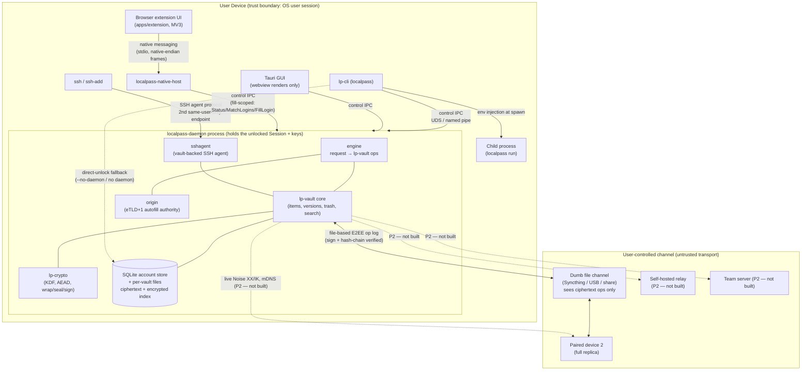

# LocalPass Architecture

**Status:** MVP feature-complete build overview
**Date:** 2026-07-04
**Audience:** new contributors — read this first, then [PRD.md](../PRD.md) §7 and the [format specs](specs/).

This document describes what is *actually built* in the repository as of the MVP
work. Where a feature is Phase 2 (`[P2]`), Future (`[F]`), or a documented
extension point that is not yet implemented, it is called out explicitly. For an
honest, bullet-by-bullet scorecard against the PRD's MVP scope, see
[mvp-acceptance.md](mvp-acceptance.md). For the security posture, see
[SECURITY.md](../SECURITY.md).

---

## 1. System summary

LocalPass is a fully local, offline password and secrets manager. All persistent
data lives encrypted at rest on the user's own machines under an envelope key
hierarchy rooted in the master password **and** a locally-generated 128-bit
Secret Key; the network is used only for user-controlled, end-to-end-encrypted
sync between the user's own devices. The system is a small set of Rust crates
with hard boundaries: a frozen-surface crypto core (`lp-crypto`), a SQLite
storage core (`lp-vault`), a sync engine (`lp-sync`), an import/export layer
(`lp-porter`), a per-user background daemon that holds the unlocked keys
(`lp-daemon`), a first-class CLI (`lp-cli`), a browser native-messaging host
(`lp-native-host`), and a Tauri desktop GUI (`apps/desktop`). The CLI, the
native-messaging host, and the GUI are all **daemon clients** — none of them
holds long-term key material; the daemon does.

---

## 2. Crate map

| Crate / app | Responsibility (one line) | Key public entry points | Depends on | License |
|-------------|---------------------------|-------------------------|------------|---------|
| **lp-crypto** | The only crate allowed to touch crypto primitives; misuse-resistant high-level API (KDF, AEAD envelopes, key wrapping, X25519 sealing, Ed25519 signing, TOTP, BLAKE3). | `derive_master_unlock_key`, `SymmetricKey::{seal,open,derive_subkey}`, `MasterUnlockKey`/`AccountKey`/`VaultKey`/`ItemKey`, `wrap_key`/`unwrap_key`, `seal_for`/`seal_key_for`, `SealingKeyPair::{open,open_key}`, `SigningKeyPair::{sign}`/`VerifyingKey::verify`, `totp::code`, `blake3_256`, `SecretKey` | RustCrypto + dalek primitives only (see §7 note) | AGPL-3.0 |
| **lp-vault** | On-disk storage core: account store, per-vault SQLite files, item versioning, folders, trash, local op-log authoring, encrypted incremental search index, backups. | `AccountStore::{create,unlock}`, `Session::{create_vault,open_vault,list_vaults,change_password,lock}`, `Vault::{create_item,get_item,update_item,delete_item,restore_version,history,list_items,search,storage_stats,prune_versions,verify_local_chain}`, `foreign::{Materialization,StoredOp}` + `Vault::apply_foreign_ops`, `backup::{create,verify,restore,restore_single_item}` | `lp-crypto`, `rusqlite` (bundled SQLite) | AGPL-3.0 |
| **lp-sync** | Op-log sync: ingest verification (signature/seq/hash-chain/Lamport), deterministic total-merge, file-based log shipping, offline device-pairing groundwork. | `engine::{setup,push,pull,status,adopt,share_vault_to_device,import_shared_key}`, `verify::verify_batch`, `merge::materialize`, `shipping::SyncDir`, `store::{Store,FsStore,StoreFactory,FsStoreFactory,StorePath}` (the channel-I/O seam; every `engine` entry point takes a `&dyn StoreFactory` and resolves the vault's opaque enrolled root string through it, so a host outside the crate can inject a non-filesystem backend; `FsStoreFactory`/`FsStore` is the only backend today), `identity::DeviceIdentity::{to_export_string,from_export_string,fingerprint}` | `lp-vault`, `lp-crypto` | AGPL-3.0 |
| **lp-porter** | Import foreign exports into `ItemPayload`s; write the recoverable age archive and guarded plaintext exports. Pure format I/O — never opens a vault, never persists. | `import::{onepux,bitwarden,lastpass,csv_generic,dotenv}::parse_*`, `import::kdbx::parse_file`, `export::archive::{encrypt_archive,decrypt_archive}`, `export::plaintext::{to_json,to_csv}`, `export::dotenv::to_dotenv` | `lp-vault` (item model), `age` (foreign-format exception) | AGPL-3.0 |
| **lp-daemon** | Per-user background process holding one unlocked `Session` behind a same-user-only IPC channel; also serves a vault-backed SSH agent on a second endpoint; server-side origin authority for autofill. | binary `localpass-daemon`; `protocol::{Request,Response}`, `client::{call,probe}`, `spawn`, `server`, `engine`, `origin::registrable_domain`, `sshagent` | `lp-vault`, `lp-crypto`, `ssh-key` (foreign-format), `windows-sys`/`libc` | AGPL-3.0 |
| **lp-cli** | The `localpass` binary: init, vault/item CRUD, generate, run/env/reference resolution, ssh, backup, import/export, sync, device, browser registration. A daemon client + direct-unlock fallback. | binary `localpass`; command tree in `cli.rs` | `lp-vault`, `lp-crypto`, `lp-daemon`, `lp-porter`, `lp-sync`, `lp-native-host`, `clap` | AGPL-3.0 |
| **lp-native-host** | The `localpass-native-host` binary: bridges a browser extension over stdio native-messaging to the daemon with a strictly fill-scoped capability; holds no keys. | binary `localpass-native-host`; `framing`, `protocol`, `bridge`, `host`, `register` | `lp-daemon` (IPC client + `origin`) | AGPL-3.0 |
| **apps/desktop** | Tauri 2 + Svelte 5 desktop GUI shell: unlock, browse, search, masked item view, reveal/copy on gesture, live TOTP, generator. A daemon client; holds no keys. | `#[tauri::command]` set in `src-tauri/src/commands.rs`; masking choke point `model::item_view_masked` | `lp-daemon` (path dep), OS webview | **MPL-2.0** |

Licensing follows PRD §5.6 / §11 #3: **AGPL-3.0** for the core/daemon crates,
**MPL-2.0** for the GUI. The workspace `Cargo.toml` sets
`license = "AGPL-3.0-only"` and `exclude = ["apps"]` so the AGPL core's
`cargo test --workspace` / clippy never build the MPL-2.0 Tauri app; the GUI is
its own Cargo workspace and reaches the core only through the `lp-daemon` path
dependency.

> **Note — the crate split vs. the PRD.** PRD §5.6 names a `lp-gui` crate; the
> GUI actually lives under `apps/desktop/src-tauri`. Two crates exist that the
> PRD's §5.6 list did not name — `lp-porter` (import/export) and
> `lp-native-host` (browser host) — carved out for clean boundaries during the
> build (see [LESSONS.md](../LESSONS.md)). The MIT/Apache-2.0 "client libraries
> and relay" licensing tier in PRD §5.6 is not yet exercised — no relay or
> standalone client library exists at MVP, so every crate that exists today is
> AGPL-3.0 except the MPL-2.0 GUI.

---

## 3. The client model

The daemon is the trust anchor on a device: it is the **only** long-lived holder
of an unlocked `lp_vault::Session` (and thus of decrypted keys). Every UI is a
client that connects to it over a same-user-only local IPC channel and asks it to
do the sensitive work.

- **CLI (`lp-cli`)** — probes for a running daemon and proxies requests to it;
  the finished output matches direct-unlock output because both use the same
  render model. With `--no-daemon` (or when no daemon is running), the CLI
  **falls back to direct unlock**: it derives keys itself, does the operation,
  and drops them — the pre-daemon behaviour. This fallback is what makes the CLI
  usable on a fresh machine or in scripts without starting a daemon.
- **Browser native-messaging host (`lp-native-host`)** — launched by the browser,
  speaks native-messaging on stdio, and bridges to the daemon with only three
  fill-scoped requests (`Status`, `MatchLogins`, `FillLogin`). Holds no keys.
- **Desktop GUI (`apps/desktop`)** — its small Rust backend connects to the same
  daemon IPC channel. The webview renders and requests; all secret handling stays
  in Rust. Holds no keys.

When the daemon is unlocked, secrets that must be produced (a revealed field, a
TOTP code, an env-set for injection) are computed **inside the daemon** and only
the finished value crosses the channel — the underlying secret material never
leaves the daemon's memory.

### 3.1 Component diagram

This reflects what is built. The self-hosted relay and a live LAN/mDNS transport
are Phase 2 / documented extension points (dashed, marked *not built*).



Compare with PRD §7.1: the shape is the same, but at MVP the only sync transport
that exists is the **file-based op log** shipped over a dumb channel; live Noise
transport, mDNS discovery, the relay, and the team server are Phase 2 / extension
points (see [sync-protocol.md](specs/sync-protocol.md) §7.4).

---

## 4. Key hierarchy and data flow

### 4.1 Key hierarchy (envelope encryption, PRD §4.3)

Implemented in `lp-crypto` (`keys`, `kdf`, `wrap`, `seal`) and consumed by
`lp-vault`:

```
master password ─┐
                 ├─ Argon2id → HKDF (label "localpass/v1/muk") ─▶ MasterUnlockKey (MUK)
 SecretKey (128b)┘                                                    │  wrap/unwrap  (AAD localpass/v1/wrap/account-key)
                                                                      ▼
                                                                  AccountKey  (random 256-bit; invariant across password change)
                                                                      │  wrap/unwrap  (AAD localpass/v1/wrap/vault-key | vault_id)
                                                                      ▼
                                                                  VaultKey ──▶ IndexKey = HKDF(VaultKey, "localpass/v1/index")
                                                                      │  wrap/unwrap  (AAD localpass/v1/wrap/item-key | vault_id | item_id | version)
                                                                      ▼
                                                                  ItemKey  (fresh per item *and per version*)
                                                                      │  seal/open (XChaCha20-Poly1305 Envelope v1)
                                                                      ▼
                                                                  item payload (canonical JSON, vault-format.md §4)
```

- The **AccountKey** never changes when the master password changes — password
  rotation only re-wraps it (`Session::change_password`), so no payload is
  re-encrypted (vault-format.md §5.5).
- Every `(item_id, version)` gets a **new ItemKey**, so nonce reuse across edits
  is structurally impossible (vault-format.md §5.3).
- The **IndexKey** is derived from the VaultKey; the search index is encrypted at
  rest under it (search-index.md §1).
- The **Secret Key** is a 128-bit second KDF factor mixed in via HKDF, so a
  stolen vault file alone cannot be brute-forced offline even with a weak master
  password (PRD §8 T1). It is stored on-device — at MVP in a
  `<profile>/secret-key` file (owner-only on Unix), the documented stand-in for
  OS-keychain storage (a P2 item; see [LESSONS.md](../LESSONS.md) and
  [mvp-acceptance.md](mvp-acceptance.md)) — and in the printed Emergency Kit.

Full envelope, AAD, and lifecycle rules are in
[vault-format.md](specs/vault-format.md).

### 4.2 Unlock → read (`item get --field`)

```
1. localpass item get GitHub --field password --vault personal
2. CLI → daemon control IPC (peer-credential / DACL check). Locked? → prompt for password.
3. password (+ Secret Key read from <profile>/secret-key) → Argon2id → HKDF → MUK
4. MUK unwraps AccountKey → unwraps VaultKey            [all in zeroize buffers]
5. VaultKey unwraps ItemKey → AEAD-decrypts the item payload
6. daemon extracts the one requested field and returns its value over the channel
7. plaintext existed only in daemon memory; only the single field crossed the wire
```

For the GUI the same read runs with `reveal = false` and is re-masked through
`model::item_view_masked` (§6); a single revealed field takes the dedicated
`reveal_field` path.

### 4.3 Unlock → inject (`localpass run`)

```
1. localpass run --env-set myapp/dev -- npm start
2. CLI resolves the env-set / --env-file references / -e mappings (localpass:// or op://)
3. keys derived (via daemon if unlocked, else direct-unlock) and env-set item decrypted
4. CLI builds the child environment (parent env + resolved vars) and spawns the child:
     - Unix: exec() — localpass is replaced by the child; it vanishes from the process tree
     - Windows: spawn with inherited stdio, wait, exit with the child's code (no exec)
5. plaintext existed only in process memory + the child's environment — never on disk
```

This is the reference workflow that removes the need to materialize `.env` files
(PRD §4.8 / §8 T16). `localpass env export` can still materialize secrets for
tools that demand a file, but it is the explicit, discouraged path.

---

## 5. Security boundaries

Mirrors PRD §7.3, narrowed to what is built:

| Boundary | Crossing | Protection (as built) |
|----------|----------|------------------------|
| Disk ↔ process | vault / account files | Envelope-encryption; only ciphertext + minimal structural metadata (ids, counters, timestamps) on disk. AAD binds `vault_id + item_id + version + purpose`, so no ciphertext blob can be relocated to another row/vault (vault-format.md §3, §10). |
| Daemon ↔ CLI / GUI / native-host | control IPC | Same-user-only channel: **Windows** named pipe `\\.\pipe\localpass-<user>` with a DACL granting only the current user's SID + `PIPE_REJECT_REMOTE_CLIENTS`; **Unix** UDS at `$XDG_RUNTIME_DIR/localpass/daemon.sock`, dir `0700` / socket `0600` + `SO_PEERCRED` euid check. The OS-enforced same-user restriction *is* the authentication (PRD §8 T8). The native-host client is further capability-scoped to fill-only. |
| Webview ↔ Rust | Tauri commands | The `#[tauri::command]` set is the whole bridge. `get_item` calls the daemon with `reveal=false` **and** re-masks via the single `#[must_use]` `model::item_view_masked` choke point (a test asserts the serialized JSON never contains a planted secret). Secrets cross only via `reveal_field` / `totp` / the generator, on an explicit gesture; strict CSP, no remote content, no eval. |
| Device ↔ device | sync op log | Every op is Ed25519-signed over its full canonical form *including ciphertext* (sign-after-encrypt) and encrypted under the VaultKey; a per-device `seq` + BLAKE3 `prev_hash` chain + Lamport monotonicity make drop/replay/rollback/tamper detectable and alarmed on ingest (sync-protocol.md §5). **At MVP the transport is the file channel; Noise mutual-auth + SAS pairing are the P2 live path.** |
| Browser ↔ host | native messaging | Host holds no keys; issues only `Status`/`MatchLogins`/`FillLogin`. Candidate lists never carry a password; on `FillLogin` the **daemon** re-validates the item's URL against the requested origin's registrable domain (`lp_daemon::origin`) server-side before releasing the secret — the extension's claim is not trusted (PRD §8 T7). |
| Vault ↔ vault | none shared | Independent VaultKeys and IndexKeys; no shared key material or ciphertext across vaults (vault-format.md §11). |

Boundaries in the PRD table that are **not built at MVP** (single-user scope):
device↔relay/team-server and user↔team-member (item/vault-key wrapping per member
+ revocation/rotation) are Phase 2; see [mvp-acceptance.md](mvp-acceptance.md).

---

## 6. Storage layout on disk

From [vault-format.md](specs/vault-format.md) §1. Everything lives under the
per-OS-user profile directory (default `%APPDATA%\localpass` on Windows,
`~/Library/Application Support/localpass` on macOS,
`~/.local/share/localpass` on Linux; override with `--profile` /
`LOCALPASS_PROFILE`):

```
<profile>/
  account.localpass          -- the account store (exactly one SQLite file):
                                KDF params + salt, wrapped AccountKey, this device's
                                identity keys, peer devices, the vault registry
                                (wrapped VaultKeys), settings. WAL + synchronous=FULL.
  secret-key                  -- MVP: the 128-bit Secret Key (owner-only on Unix);
                                OS-keychain stand-in (P2). Also in the Emergency Kit.
  vaults/
    <vault_id>.vault          -- one SQLite file per vault: items, immutable
                                item_versions, wrapped per-version ItemKeys, folders,
                                tombstones (trash), the signed hash-chained op log,
                                and encrypted search-index segments. WAL + FULL.
    <vault_id>.vault-wal      -- SQLite WAL sidecar (transient)
    <vault_id>.vault-shm      -- SQLite shared-memory sidecar (transient)
  sync/                       -- file-based log-shipping root (when a vault is
                                enrolled): <vault_id>/{manifest.json, ops/<device>/…,
                                chain/<device>.head, keys/…}. See sync-protocol.md §7.
  backups/                    -- rotating encrypted snapshots (backup create);
                                also pre-restore-<ts>/ safety copies (backup restore).
  attachments/                -- reserved (P2); not implemented at MVP.
```

Notes grounded in the specs and code:

- The account store holds the authoritative **vault registry**; the `vaults/`
  file layout is a cache derivable from it (vault-format.md §1).
- Durability is uniform: `journal_mode=WAL`, `synchronous=FULL`,
  `foreign_keys=ON` on **both** file kinds; each item mutation writes its op-log
  row and its search-index update in the **same transaction** as the state
  change, so local vault state and the local op log never diverge
  (vault-format.md §7, [LESSONS.md](../LESSONS.md)).
- Backups are taken with SQLite's Online Backup API (a consistent snapshot of a
  live WAL-mode DB, not a raw file copy) and carry a plaintext `manifest.json` of
  file hashes + item counts (no secrets).

---

## 7. Notes, cross-links, and where things are *not* built

- **Crypto boundary.** `lp-crypto` is the only crate that depends on primitive
  crates (RustCrypto/dalek). Two narrow foreign-format exceptions exist and are
  documented: `lp-porter` uses the `age` crate for the recoverable export
  archive, and `lp-daemon` uses `ssh-key` for OpenSSH-format user keys in the SSH
  agent. Both reuse the exact primitive versions `lp-crypto` pins — no duplicated
  crypto surface ([LESSONS.md](../LESSONS.md)).
- **No dedicated audit log.** The only hash-chained log in the system is the
  **sync op log** (item mutations: create/update/delete/restore/rewrap). A
  dedicated tamper-evident *audit* log of reads/unlocks/exports per PRD §4.9 is
  **not implemented** — see [mvp-acceptance.md](mvp-acceptance.md).
- **Sync is file-based only** at MVP. Live Noise/mDNS transport, the relay, and
  team sharing/roles/revocation are Phase 2 / documented extension points
  (sync-protocol.md §6, §7.4, §10).
- **Browser: host + extension.** The native-messaging *host* binary is built and
  registrable (`localpass browser register`); the MV3 *extension UI*
  (`apps/extension/`, MPL-2.0) is built on top of it — fill-on-gesture, no
  auto-submit, top-frame-only, minimal permissions. Save-from-browser is a
  follow-up (the host is fill-scoped by design).
- **KDBX 4 import** (KeePass, AES-256 / Argon2) is implemented with a focused
  reader on RustCrypto primitives aligned to `lp-crypto`'s versions — not the
  85-crate `keepass` dependency — under `lp-porter`'s foreign-format crypto
  exception. All MVP import formats work. See [mvp-acceptance.md](mvp-acceptance.md).

Specs and PRD sections referenced throughout:
[vault-format.md](specs/vault-format.md),
[search-index.md](specs/search-index.md),
[sync-protocol.md](specs/sync-protocol.md),
[PRD.md](../PRD.md) (§4 functional requirements, §5 non-functional, §6 tech
stack, §7 architecture, §8 threat model, §9 MVP scope, §11 decision log).
